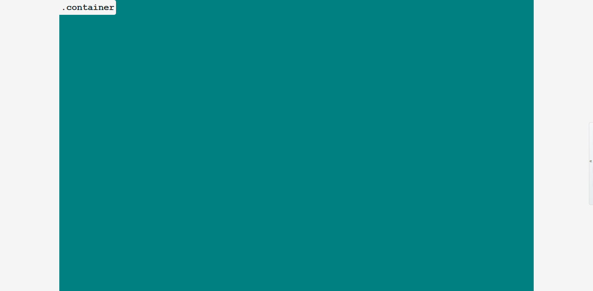
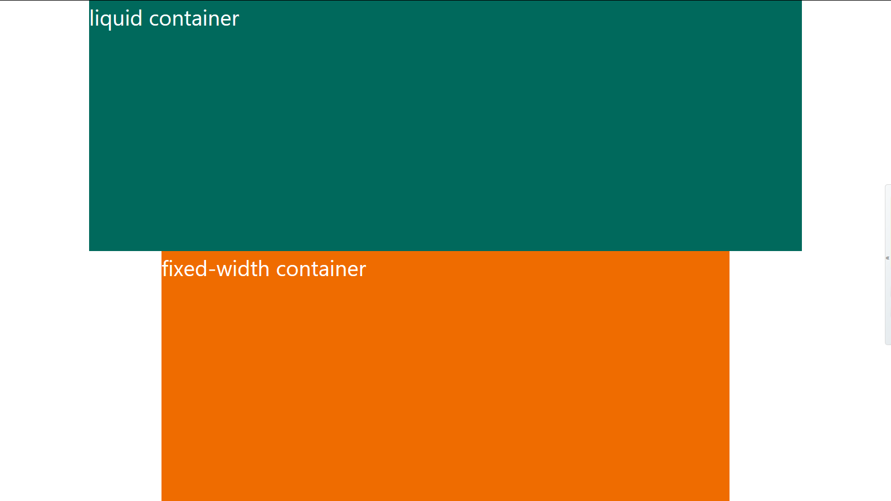
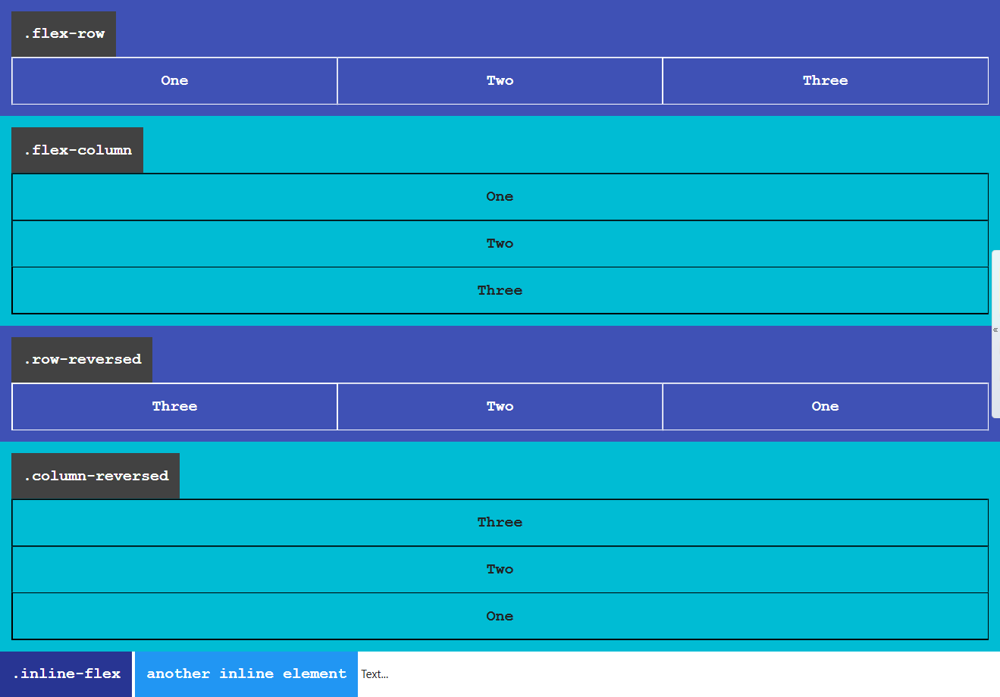
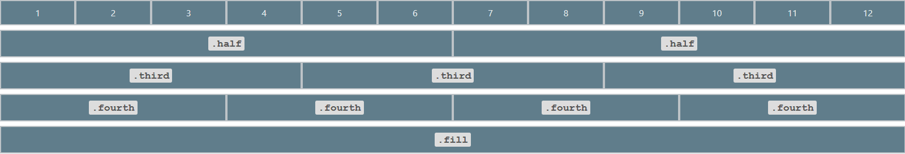
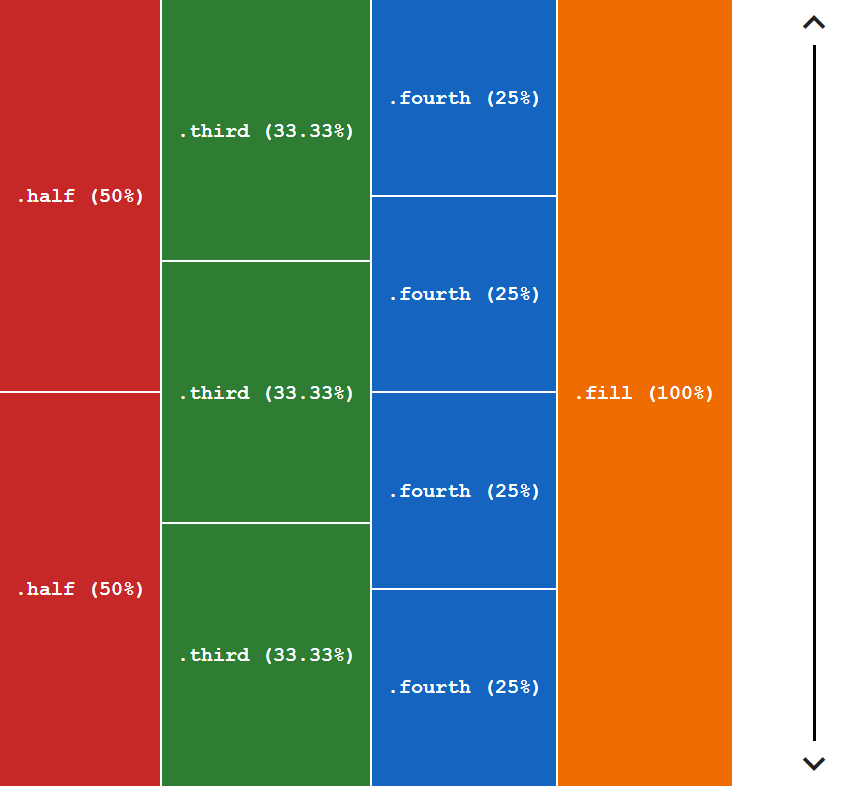
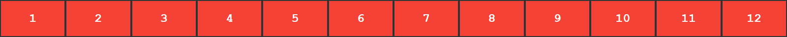
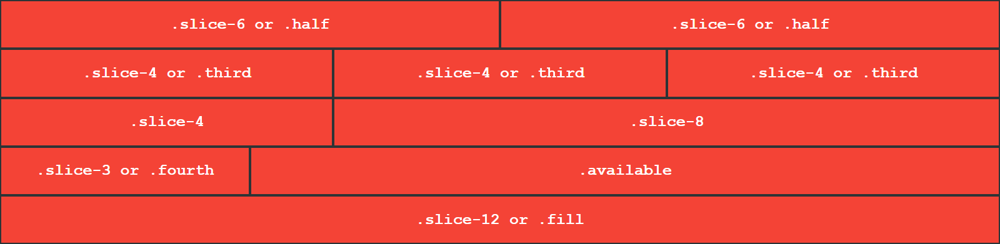

<!--
 _   _                                             
| | | |                                            
| | | |  _          ,         , _|_  _   _  _  _   
|/  |/  |/  /\/    / \_|   | / \_|  |/  / |/ |/ |  
|__/|__/|__/ /\_/   \/  \_/|/ \/ |_/|__/  |  |  |_/
|\                        /|                       
|/                        \|                       

-->

# What Is flex-system?

flex-system is a fully customizable css grid system framework based on flexbox.

## Instalation

install with npm:

```bash
  npm install flex-system
```
include using cdn.jsdelivr:
```html
  <link rel="stylesheet" href="https://cdn.jsdelivr.net/gh/Sanusihassan/flex-system/css/flex-system.min.css">
```

## Usage

`.container` class creates a container that can be used to to pad the content inside it.



The green area in this case represents the container.

```html
  <!-- to create a container -->
  <section class="container">
    <!-- content -->
  </section>
```

| Breakpoint Name | Breakpoint Range | Container Width |
|-----------------|------------------|-----------------|
| Small (Mobile)          | < 600px                 | 100%            |
| Medium (Tablet)         | >= 600px          | 85%             |
| Large (Small Laptops)          | >= 992px	         | 80%             |
| Larger (Laptops & Desktops)         | >= 1200px         | 80%             |

When you create a container you have the option to make it either a `fixed-width` container or
`liquid-container` which is the default behavior.

The `container` width is controled via the following variables:
* `--container-small-width`: controls container width onsmall breakpoint - (Mobile).
* `--container-medium-width`: controls container width onmedium breakpoint - (Tablet).
* `--container-large-width`: controls container width onlarge breakpoint - (Laptops).
* `--container-larger-width`: controls container width onlarger breakpoint - (Laptops & Desktops).

To customize the `container` width change any of the above variable values in your css:
```scss
  /* you can use any other selector */
  :root { 
    // if you want to change the container width on medium breakpoint.
    --container-medium-width: 75%; /* default is 85% */
    --container-large-width: 90%; /* defult is 80% */
    --container-larger-width: 85%; /* default is 80% */
  }
```

### Fixed Width Container

A fixed width container is a container that has a fixed width, ie px.



To create a `fixed-width` container use the `.fixed-width` class with the `.container` class:


```html
  <!-- fixed-width container -->
  <section class="fixed-width container">
    <!-- content -->
  </section>
```


| Breakpoint Name | Breakpoint Range | Container Width |
|-----------------|------------------|-----------------|
| Small           | < 600px                 | 100%            |
| Medium          | >= 600px          | 510px (`85% of 600px`)             |
| Medium to large          | >= 768px <992          | 614.4px (`85% of 768px`)             |
| Large           | >= 992px	         | 843.2px (`85% of 992px`)             |
| Larger          | >= 1200px         | 1020px (`85% of 1200px`)             |

> **Note**: The above Widths are going to be applied to the container only if you use the `.fixed-width` class with the `.container`

To customize the Fixed width container use any of the following css variables:

```scss
  :root {
    --container-small-fixed-width: 100%;
    --container-medium-fixed-width: 510px;
    /* controls container width from 768px to 992px */
    --container-medium-to-large-fixed-width: 652.8px;
    --container-large-fixed-width: 843.2px;
    --container-larger-fixed-width: 1020px;
  }
  /*
    we use this formula to calculate a fixed width for the container
    width: #{(percentage)} * $breakpoint
  */
  // example
  .container {
    // this example uses sass but you can use any method to calculate this value
    --container-medium-fixed-width: #{(80/100)} * 992px; // 80% * 992px = 793.6px
  }
```

Use `.flex-sys` class with `.container` to reduce conflict if you are using another css framework that uses the same name and you want to use flex-system container.

```html
  <!-- flex-system container -->
  <section class="flex-sys container">
    <!-- this is flex-system container and it can be customized -->
  </section>
```


## Flex Row And Flex Column Containers


`.flex-row` and `.row-reversed` classes create row containers.

Their children/flex-items flows in a row direction, from left to right if you are using a `ltr` language like english.

Or from right to left if you are using a `rtl` language like arabic.

Whether you use english or arabic items are going to appear in a row.

```html
  <!-- flex row container -->
  <div class="flex-row">
    <div>One</div>
    <div>Two</div>
    <div>Three</div>
  </div>
  <!-- row reversed same as .flex-row except the main-start and main-end directions are swapped -->
  <div class="row-reversed">
    <div>One</div>
    <div>Two</div>
    <div>Three</div>
  </div>
```

### Responsive flex row containers
You can also define a flex row container within a breakpoint range
```html
  <!-- row onsmall-only -->
  <div class="row-onsmall">
    <div>One</div>
    <div>Two</div>
    <div>Three</div>
  </div>
```

#### Posibilities:
* `.row-onsmall`: flex row onsmall only
* `.row-onmedium`: flex row onmedium only
* `.row-onlarge`: flex row onlarge only
* `.row-from-larger`: flex row from larger and up

`.flex-column`, `.column-reversed` classes creates flex column containers.

Flex-items inside a flex column container are stacked on top of each other in a column direction.

```html
  <!-- flex column container -->
  <div class="flex-column">
    <div>One</div>
    <div>Two</div>
    <div>Three</div>
  </div>

  <!-- column reversed same as .flex-column except the main-start and main-end directions are swapped -->
  <div class="column-reversed">
    <div>One</div>
    <div>Two</div>
    <div>Three</div>
  </div>
```

### Responsive flex column containers

You can also define a flex column container within a breakpoint range

```html
  <!-- column onmedium only -->
  <div class="column-onmedium">
    <div>One</div>
    <div>Two</div>
    <div>Three</div>
  </div>
  <!-- onsmall stack on top of each other, but from medium and up stay in one row -->
  <div class="column-onsmall flex-row">
    <div>item 1</div>
    <div>item 2</div>
    <div>item 3</div>
  </div>
```

#### Posibilities:

* `.column-onsmall`: flex column onsmall only
* `.column-onmedium`: flex column onmedium only
* `.column-onlarge`: flex column onlarge only
* `.column-from-larger`: flex column from larger and up

The `.inline-flex` class makes an element to be displayed as inline-flex container.

```html
  <div class="inline-flex flex-row">
    inline flex-row container
  </div>
```

### Flex Item Shrinking

By default when using [flex box](https://developer.mozilla.org/en-US/docs/Learn/CSS/CSS_layout/Flexbox "Flexbox - Learn web development | MDN"), flex items are defined to shrink if there is no space available.

If you want to specify that flex items should not shrink use the `.noshrink-each` class with flex row containers or flex column containers or `.noshrink` with a flex item.
```html
  <div class="flex-row noshrink-each">
    <div>my width will stay fixed</div>
    <div>me too!</div>
    <div class="flex-row">
        me too!
        <div>not me, i will shrink :)</div>
    </div>
  </div>
  <!-- .noshrink on individual flex items -->
  <div class="flex-row">
    <div class="noshrink">my width will stay fixed if you define it</div>
    <div>i will shrink</div>
  </div>
```
### Wrapping Behavior

When using flex-system flex row container's direct children are defined to wrap (go to the next line) if there is no space available to take them on one line.

The `.nowrap` class overwrites this behavior.
```html
  <!-- these items are going to stay in on line and they will shrink if there is no space available -->
  <div class="flex-row nowrap">
    <div>item #01</div>
    <div>item #02</div>
    <div>item #03</div>
  </div>
```

`.wrap-reversed` specifies that flex items should wrap in a reversed order.

```html
  <div class="flex-column wrap-reversed">
    <div>item #01</div>
    <div>item #02</div>
    <div>item #03</div>
  </div>
```

### Responsive Wrapping

These are set of classes that specifies that flex items should wrap within a breakpoint range.

Or starting from a breakpoint and up.

```html
  <!-- nowrapping on each breakpoint except small -->
  <div class="row-reversed nowrap onsmall-wrap">
    <div>item #01</div>
    <div>item #02</div>
    <div>item #03</div>
  </div>
  <!-- wrap from medium screens and up -->
  <div class="flex-row from-medium-wrap">
    <div>item #01</div>
    <div>item #02</div>
    <div>item #03</div>
  </div>
```

#### Posibilities:

* `.onsmall-wrap` wrap on small breakpoint only.
* `.onmedium-wrap` wrap on medium breakpoint only.
* `.onlarge-wrap` wrap on large breakpoint only.
* `.from-medium-wrap` wrap from medium devices and up.
* `.from-large-wrap` wrap from large devices and up.
* `.from-larger-wrap` wrap only starting from larger breakpoint and up.

The `.wrap` class specifies that flex container direct children should wrap (go to the next line if necessary).

```html
  <!-- flex row containers default behavior of wrapping is to wrap when using flex-system -->
  <div class="flex-column wrap">
    <div>item #01</div>
    <div>item #02</div>
    <div>item #03</div>
  </div>
```

## Grid System

Grid system classes specifies element width inside a flex row container,
and height inside a flex column container.

flex-system is using 12 columns grid system.

flex-system provides symantic easy to use class names for the grid system.

* `.half` means one half, the element will take `50%` width if it's parent is a flex row container and `50%` height if it's parent is a flex column container.

* `.third`: `33.33%`
* `.fourth`: `25%`
* `.fill`: `100%`

Flex row container:



Flex column container:



```html
  <!-- flex row container -->
  <div class="flex-row noshrink-each">
    <div class="half">.half (50%)</div>
    <div class="half">.half (50%)</div>
    <div class="third">.third (33.33%)</div>
    <div class="third">.third (33.33%)</div>
    <div class="third">.third (33.33%)</div>
    <div class="fourth">.fourth (25%)</div>
    <div class="fourth">.fourth (25%)</div>
    <div class="fourth">.fourth (25%)</div>
    <div class="fourth">.fourth (25%)</div>
    <div class="fill">.fill (100%)</div>
  </div>
  <!-- flex column container -->
  <div class="flex-column wrap">
    <div class="half">.half (50%)</div>
    <div class="half">.half (50%)</div>
    <div class="third">.third (33.33%)</div>
    <div class="third">.third (33.33%)</div>
    <div class="third">.third (33.33%)</div>
    <div class="fourth">.fourth (25%)</div>
    <div class="fourth">.fourth (25%)</div>
    <div class="fourth">.fourth (25%)</div>
    <div class="fourth">.fourth (25%)</div>
    <div class="fill">.fill (100%)</div>
  </div>
```

Earlier i've mentioned that flex-system is using 12 columns grid system.

What was that means?

Imagine that the web page is devided into 12 slices or (columns) as follows:





`.slice-1` takes one slice out of 12 slices, `.slice-6` takes 6 slices out of 12 slices, and so on.

The `.available` class specifies that an element should grow to takes the available space.

```html
  <div class="flex-row">
    <div class="slice-1">one slice out of 12 slices</div>
    <div class="slice-2">2 slices out of 12</div>
    <div class="slice-7">slice-7 (7 slices)</div>
  </div>
```

### Responsive Grid

So far, we've been using the global breakpoint to create our layout.

However, we may want to use a responsive grid, to have more control over the web page, across all defferent viewports.

To use responsive grid use one of the following prefexes as a class followed by a number or a name that represenets how many slices do you want your element to take.

* `onmedium` (for tablets - screens less than 992px wide)
* `onlarge` (for laptops - screens equal to or greater than 992px wide)
* `onlarger` (for large laptops and desktops - screens equal to or greater than 1200px wide)

```html
  <div class="flex-row">
    <div class="fill">full width on all viewports</div>
    <!-- fill, but take 5 slices starting from medium and up, one third from large and up one half onlarger -->
    <div class="fill onmedium-5 onlarge-third onlarger-half">fill onmedium-5 onlarge-third onlarger-half</div>
    <div class="onlarge-3">25% onlarge and up</div>
  </div>
```
Another Example:
```html
<div class="flex-row">
    <div class="fill onmedium-4 onlarge-2">fill onmedium-4 onlarge-2</div>
    <div class="fill onmedium-4 onlarge-8">fill onmedium-4 onlarge-8</div>
    <div class="fill onmedium-4 onlarge-2">fill onmedium-4 onlarge-2</div>
</div>
```

### Alternative for grid system classes
Sometimes you may have a long string of classes which is very hard to read and maitain if you have a big project.

That's why an alternatives can be very handy.


The alternatives are a set of `data-*` attributes and they do the same thing that the grid system classes does, except that they keep your code cleaner.

* `data-slice=$value` for global viewport.
* `data-onmedium=$value` for medium viewport.
* `data-onlarge=$value` for large viewport.
* `data-onlarger=$value` for larger viewport.

If you have a long list of classes

Instade of writing this:
```html
  <div class="fill onmedium-5 onlarge-third onlarger-half">fill onmedium-5 onlarge-third onlarger-half</div>
  <div class="fill onmedium-4 onlarge-2 a b c d e f ...">fill onmedium-4 onlarge-2</div>
```

You should write this:
```html
  <div
    data-slice="fill"
    data-onmedium="5"
    data-onlarge="third"
    data-onlarger="half"
  >
    fill onmedium-5 onlarge-third onlarger-half
  </div>

  <div 
    data-slice="fill"
    data-onmedium="4"
    data-onlarge="2"
    class="a b c d e f ..."
  >
    fill onmedium-4 onlarge-2
  </div>
```
This can simplify your code alot!

## Customizing The Grid

Lets say that we have two divs and each of them has a `.half` class.

As you know `.half` is `50%`, but we want `49%` insted.

And we will use the available `2%` to align the two divs.

**We need to customize the grid**

<hr />

To customize the grid we should change the `--size` value on each class that we want to customize.

There are predefined css variables that can be used to calculate the value.

They are defined in the root level element as follows:

```css
  /* to see this in your browser open the inspector and select <html> from the Elements tab */
  :root {
    --slice-1: 8.3333333333%;
    --slice-2: 16.6666666667%;
    --fourth: 25%;
    --third: 33.3333333333%;
    --slice-5: 41.6666666667%;
    --half: 50%;
    --slice-7: 58.3333333333%;
    --slice-8: 66.6666666667%;
    --slice-9: 75%;
    --slice-10: 83.3333333333%;
    --slice-11: 91.6666666667%;
    --fill: 100%;
  }
```
We will use the `--half` variable and as a value for our `--size` property.

```css
  .custom-half {
    --size: calc(var(--half) - 1%);/* 49% */
  }
```

This can be applied to any other class in the grid system.

```css
  .fill {
    --size: calc(var(--fill) + 5%);
  }
  .onmedium-fourth {
    --size: calc(var(--fourth) / 3);
  }
```

You can also change the value from the html but it is not recommended, because it complicates your code.

```html
  <div class="flex-row">
    <div style="--size: calc(var(--half) - 5%)" class="half">.half - 5%</div>
    <div style="--size: calc(var(--half) - 5%)" class="half">.half - 5%</div>
  </div>
```

## Taking The Available Space

To specify that an element should grow and take the available space use the `.available` class:

```html
  <div class="flex-row">
    <!-- (2 slices) -->
    <div class="slice-2">two slices</div>
    <!-- the available space (10 slices) -->
    <div class="available">i'll take the available space</div>
  </div>
```

You can also use the `.available-each` class on a flex container to ensure that each flex item should grow and take the available space.

```html
  <!-- each direct element should take the available space -->
  <div class="row-reversed available-each">
    <div>item 1</div>
    <div>item 2</div>
    <div>item 3</div>
  </div>
```
Instade of the `.available` class you can use `data-slice=available`, `data-onmedium="available"` and so on.
```html
  <div class="flex-row">
    <div class="half">50%</div>
    <div data-slice="available">50%</div>
  </div>
```

### Take The Available Space On Breakpoint Range
The `.available` and the `.available-each` are also available on all breakpoints.

```html
  <div class="flex-row">
    <div 
      data-slice="fill"
      data-onmedium="half"
      data-onlarge="8"
    >
      fill onmedium-half onlarge-8
    </div>
    <div class="fill onmedium-available">
      same as: fill onmedium-half onlarge-4
    </div>
  </div>
```

```html
  <div class="flex-row onlarge-available-each">
    <div class="fill">
      same as: fill onlarge-half
    </div>
    <div data-slice="fill">
      same as: fill onlarge-half
    </div>
  </div>
```
You can use:

* `data-slice="available"` for global viewport.
* `data-onmedium="available"` for medium viewport.
* `data-onlarge="available"` for large viewport.
* `data-onlarger="available"` for larger viewport.

### Customizing The `.available` and `.available-each`

To Customize The `.available` and `.available-each` use the `--portion`.

## Some Shortcuts

`.flex-initial` resets the item to the initial values of Flexbox, this is the same as using flex: 0 1 auto, in this case the flex item will not grow larger than it's initial size, and the item will shrink if it needs to rather than overflowing.

`.flex-auto` this is the same as `.flex-initial` but in this case the item can grow and fill the container as well as shrink if required, and this is the same as using flex: 1 1 auto

`.flex-none` this will create a fully inflexable flex item. It is as if you wrote flex: 0 0 auto. The items cannot grow or shrink but will be laid out using flexbox with a flex-basis of auto.

These classes are also available for all breakpoints: 

use these prefexes = [`onmedium-`, `onlarge-`, `onlarger-`].

```html
  <div class="flex-row">
    <div class="available onlarger-flex-initial">
      i'll stretch to take the available space untill larger screens
    </div>
  </div>
```

## Element Order

`.{$breakpoint}order-$n` classes specifies element order inside the flex parent `$n` = [`1 - 6`].

`$breakpoint` = [`onmedium-`, `onlarge-`, `onlarger-`].

```html
  <div class="flex-column">
    <div class="fill order-3 onmedium-order-1">first onmedium and up, third onsmall</div>
    <div class="order-2">second</div>
    <!-- reducing conflict -->
    <div class="flex-sys order-1">first</div>
    <!-- to customize order classes use .order-6/$breakpiont-order-6 then use --order variable on it -->
    <div style="--order: 0" class="order-6">im the first one</div>
  </div>
```

## Alignment On The Main Axis

The `.{$breakpoint}main-$direction` classes specifies flex items alignment within the flex parent in the main axis direction.

`$direction` = [`start`, `end`, `center`].

`start` is the default value. and it can be used from medium and up.

The `.space-$direction` or `.on{$breakpoint}sp-$direction` classes are used to distribute available space in the main axis.

`$direction` = [`between`, `around`, `evenly`].

```html
  <!-- alignment -->
  <div class="flex-row main-end onmedium-main-center onlarge-main-start">
    <div class="third">item</div>
    <div class="third">item</div>
    <div class="third">item</div>
  </div>
  <!-- available space distribution -->
  <div class="flex-row space-between onmedium-sp-around">
    <div class="third">flex-item</div>
    <div class="third">flex-item</div>
    <div class="third">flex-item</div>
  </div>
```

You can use the `data-$breakpoint-main-align=$value` attributes.

```html
  <!-- alignment -->
  <div
      class="flex-row"
      data-main-align="end"
      data-onmedium-main-align="center"
      data-onlarge-main-align="start"
    >
    <div class="third">item</div>
    <div class="third">item</div>
    <div class="third">item</div>
  </div>
  <!-- available space distribution -->
  <div
    class="flex-row"
    data-main-align="space-between"
    data-onmedium-main-align="space-around"
    >
    <div class="third">flex-item</div>
    <div class="third">flex-item</div>
    <div class="third">flex-item</div>
  </div>
```

## Flex Lines Alignment

Flex lines alignment classes sets the distribution of space between and around content **items** along the cross-axis.

Flex lines alignment classes are the same as main axis alignment classes with some expectations.

* insteade of `main` prefix use the `line` prefix.
* insteade of `space` prefix use the `line-sp-` prefix.

the line alignment classes contains the `stretch` value as in `.line-stretch`.

```html
  <!-- alignment -->
  <div class="flex-row line-end onlarge-line-center">
    <div class="available">flex-item</div>
    <div class="available">flex-item</div>
    <div class="available">flex-item</div>
  </div>
  <!-- space distribution -->
  <div class="flex-row line-sp-between onmedium-line-sp-around onlarge-line-stretch">
    <div class="available">flex-item</div>
    <div class="available">flex-item</div>
    <div class="available">flex-item</div>
  </div>
```

You can also use the `data-$breakpoint-line-align=$value` attributes.

```html
  <!-- alignment -->
  <div
    class="flex-row"
    data-line-align="end"
    data-onmedium-line-align="start"
    data-onlarge-line-align="center"
  >
    <div class="available">flex-item</div>
    <div class="available">flex-item</div>
    <div class="available">flex-item</div>
  </div>
  <!-- space distribution -->
  <div 
      class="flex-row"
      data-line-align="space-between"
      data-onmedium-line-align="space-around"
      data-onlarge-line-align="stretch"
    >
    <div class="available">flex-item</div>
    <div class="available">flex-item</div>
    <div class="available">flex-item</div>
  </div>
```

## Alignment On The Cross Axis Classes For Flex Parent

The `.{$breakpoint}cross-align-$direction` classes are used to distribute space in the cross axis of a flex container.

`$direction` = [`start`, `center`, `end`, `baseline`, `stretch`]

```html
  <div class="flex-row main-start cross-align-end onmedium-cross-align-stretch onlarge-cross-start">
    <div class="available onlarge-8">item</div>    
    <div class="half onlarge-third">item</div>    
  </div>
```

You can also use the `data-$breakpoint-cross-align=$value` attributes.

```html
  <div
      class="flex-row main-start"
      data-cross-align="end"
      data-onmedium-cross-align="stretch"
      data-onlarge-cross-align="start"
    >
    <div class="available onlarge-8">item</div>    
    <div class="half onlarge-third">item</div>    
  </div>
```

## Alignment On The Cross Axis Classes For Flex Item

The `.{$breakpoint}self-align-$direction` classes specifies the distribution of the available space in the cross axis for a flex item. 

`$direction` = [`start`, `center`, `end`, `baseline`, `stretch`].

```html
  <div class="flex-row">
    <div class="available self-align-stretch">item #01</div>
    <div class="available self-align-end">item #02</div>
    <div class="available self-align-center">item #03</div>
  </div>
```

You can also use the `data-$breakpoint-self-align=$value` attributes.

## Auto Margins

`.{$breakpoint}push-$direction`, classes are used to push an element into a direction.

`$direction` = [`top`, `right`, `bottom`, `left`, `center-x`, `center-y`].

```html
  <div class="flex-row">
    <div class="push-right">i will be pushed to the right</div>
  </div>
  <div class="flex-row">
    <div class="onmedium-push-center-y">vertically centered from medium and up</div>
  </div>
  <div class="flex-row">
    <div class="onlarger-right">i'll go right onlarger screens and up</div>
  </div>
```

You can also use the `data-$breakpoint-push=$value` attributes.

## Display Toggling Classes

The `.none` class and `data-display="none"` attribute hides an element.

```html
  <div class="none">this element is invisible</div>
  <div data-display="none">this element is invisible</div>
```

After that you can decide to display the element on a breakpoint range or starting from a breakpoint.

<hr>

### Display On Breakpoint Ranges
The `.display-$breakpoint` classes and `data-display-on$breakpoint=$value` attributes displays an element as flex within a breakpoint range.

`$breakpoint` = [`onsmall`, `onmedium`, `onlarge`, `onlarger`]


```html
  <div class="none display-onmedium">
    i'll be displayed as flex onmedium only
  </div>
  <!-- or -->
  <div 
    class="none"
    data-display-onmedium="flex"
    >
    i'll be displayed as flex onmedium only
  </div>
```

If you don't want to  display the element as `flex` use one of the following classes.

* `.block` displays the element as block.
* `.inline-block` displays the element as inline-block.
* `.inline-flex` displays the element as `inline-flex` container.
* `.initial` displays the element with it's initial value of the `display` property.

```html
  <div class="none display-onlarge block">
    i'll be visible on large screens only as block level element
  </div>
  <table class="none display-onlarge initial">
    display:none, onlarge display: initial
  </table>
```

### Display Starting From A Breakpoint

To display an element starting from a breakpoint use the `.display-from-{$breakpoint}` classes or `data-display-from-$breakpoint=$value` attributes.

`$breakpoint` = [`onsmall`, `onmedium`, `onlarge`, `onlarger`]

If you don't want to  display the element as `flex` use one of the following classes.

* `.block` displays the element as block.
* `.inline-block` displays the element as inline-block.
* `.inline-flex` displays the element as `inline-flex` container.
* `.initial` displays the element with it's initial value of the `display` property.

```html
  <div
    data-display="none"
    data-display-from-medium="flex"
  >
    i'll be displayed as flex from medium and up
  </div>
  <div class="none display-from-large block">
    i'll be visible from large screens and up as block level element
  </div>
  <div class="none display-onlarger">
    i'll be visible from larger screens and up
  </div>
```

## Responsive Typography

flex-system.css supports responsive typography.

### Headings

headings font-size is scalable automatically when using flex system.

```html
  <h1>respnsive typography</h1>

  <!-- reducing conflict -->
  <h1 class="flex-sys h1">respnsive typography</h1>
```

```css
  /* you can increase or decrease the amount of scaling by modifing the css --amount variable */
  :root {
    --amount: .25em;/* default value is 0.5rem */
  }
```
## Responsive Paragraph

To make the font size of a paragraph responsive use the `.responsive` class.

```html
  <p class="responsive">this is a responsive paragraph (resize the window).</p>
```

```css
/* you can increase or decrease the amount of scaling by modifing the css --p-amount variable */
.example {
  --p-amount: .25em;/* default value is 1.15em */
}
```

## Fill parent Helper Classes

`.full-width`, `.full-height`, `.full-width-height` classes specifies that an element should take full(width/height) or both of the containing element.

```html
  <div class="flex-column">
    <div class="full-width">i will fill my parent</div>
  </div>
  <div class="flex-column full-width-each">
    <div>i will fill my parent</div>
    <div>me too</div>
    <div>me too</div>
  </div>
```
You can also use the `data-full-width`, `data-full-height`, `data-full-width-height` attributes.

You might also want to use the `.width-auto` class wich is going to be ignored by the `.full-*` classes.

```html
  <div class="flex-column full-width-each">
    <div>i will fill my parent</div>
    <div>me too</div>
    <!-- or data-width="auto" -->
    <div class="width-auto">not me</div>
  </div>
```

>  Ask [me](https://twitter.com/__sanusi) any questions at any time :)